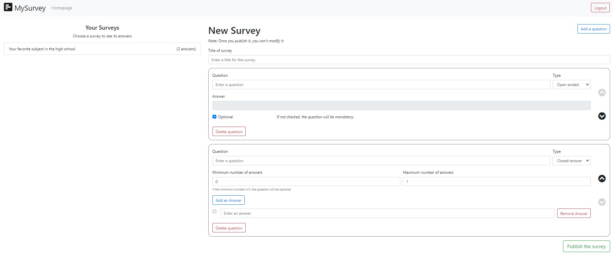

# Exam #1: "Survey"

## Student: s281290 VITALI GIACOMO

## React Client Application Routes

- Route `/`: homepage of the app. Unauthenticated users will see a welcome message. Authenticated users will see a welcome back message and a button to create a new survey.
- Route `/login`: public page that allows the unauthenticated users to login. If the login will be successful they will be redirected to `/`.
- Route `/survey/:surveyId`: public page that shows to unauthenticated users a form to complete and send the survey's answer. Authenticated users will see the answers of the users with the possibility to navigate through them.
- Route `/create`: not public. Through this page, authenticated users can create a new survey.

## API Server

- POST `/api/sessions`
  - request body content: email and password of the user.
  - response body content: information about the user(id, name, and email).
- DELETE `/api/sessions/current`
  - request parameters: _none_
  - response body content: _none_
- GET `/api/sessions/current`
  - request parameters: _none_
  - response body content: information about the user (id, name, and email).
- GET `/api/surveys`
  - request parameters: _none_
  - response body content: an array of objects, each describing a survey (id, title, and number of answers).
- GET `/api/usersurveys`
  - request parameters: id of the authenticated user.
  - response body content: an array of objects, each describing a survey of the selected user (id, title, and number of answers).
- GET `/api/surveys/:surveyId`
  - request parameters: id of the selected survey.
  - response body content: an object that contains all the questions of the selected survey.
- POST `/api/surveys`
  - request body content: information about the survey (the title and an array of objects with all the questions. The array contains for each object title, open, optional, min, max, position, and an array of objects with all the answer of a closed-answer that contains the text for each answer).
  - response body content: id of the added survey.
- GET `/api/answers/:surveyId`
  - request parameters: id of the survey.
  - response body content: an array of objects that contains all the information about unauthenticated users that answer the survey and all their answers.
- POST `/api/answers/`
  - request parameters: information about the answers to the survey (username, surveyid, and a list with all the answers. Each answer has questionId and text).
  - response body content: id of the added answers.

## Database Tables

- Table `surveys` - contains id(integer), title(text), userid(integer), answers(integer). It is used to store the information about titles of surveys, the user that creates them, and the number of answers they have.
- Table `questions` - contains id(integer), surveyid(integer), title(text), open(integer), optional(integer), minanswers(integer), maxanswers(integer), position(integer). It is used to store the information about a single question.
- Table `closedanswers` - contains id(integer), questionid(integer), text(text). It is used to store the answer for the closed-answer questions.
- Table `answers` - contains id(integer), name(text), surveyid(integer). It is used to store the name of the unauthenticated user that sent the answer.
- Table `singleanswers` - contains id(integer), surveyid(integer), questionid(integer), answer(text), asnwerid(integer). It is used to store the answers divided by survey and unauthenticated user that sent the answers.
- Table `users` - contains id(integer), name(text), email(text), password(text). It is used to store the administrators information.

## Main React Components

- `AllSurveys` (in `LeftSidebar.js`): this component represents the list of all surveys that the unauthenticated user can compile and send. If empty, it shows a text that says that there are no surveys. If the user clicks on a survey he will be redirected to `Survey` component.
- `MySurveys` (in `LeftSidebar.js`): this component represents the list of the surveys that the authenticated users created with the answers for each survey. The surveys with 0 answers aren't clickable, while the others show to the users the `Survey` component with the unauthenticated users' answers.
- `CreateSurvey` (in `CreateSurvey.js`): this component represents the form for creating a new Survey and a field to add _title_ to the survey, a button to _add_ a new question, and a button to _publish_ the survey. It contains `Question` component.
  - `Question` (in `CreateSurvey.js`): this component represents a single question that the authenticated user created. It contains a field to write the _text_ for the question, a button to _delete_ the question, two _arrows_ to move the question up and down, and a _selector_ to switch from _open-ended_ question to _closed-answer_ and vice versa. Also, this component includes `OpenEnded` and `ClosedAnswer` components.
    - `OpenEnded` (in `CreateSurvey.js`): this component represents a single open-ended question with a disabled field to show to the authenticated user how the question will be when he will publish the survey.
    - `ClosedAnswer` (in `CreateSurvey.js`): this component represents a single closed-answer question. It has a field to insert the number of _minimum answers_ and a field to insert the number of _maximum answers_. Also, it includes a button to _add_ a new answer and the `Answer` component.
      - `Answer` (in `CreateSurvey.js`): this component represents a single answer on a closed-answer question. It has a field to insert the _answer_, and a button to _delete_ it.
- `Survey` (in `Survey.js`): this component represent the form compiling the survey's answers for unauthenticated users or the prefilled form to see the answers for authenticated users. It contains the _name_ of the unauthenticated user with two _arrows_ (left and right) to move through different users' answers and two components: `OpenQuestion` and `ClosedQuestion`.
  - `OpenQuestion` (in `Survey.js`): this component represents a single open-ended question's answer which a field for the _answer_.
  - `ClosedQuestion` (in `Survey.js`): this component represents a single closed-answer question with different _checkboxs_ to select the answers.
- `Login` (in `Login.js`): this component represents the login. Unauthenticated users can see a form with _email_ and _password_ to fill in.

## Screenshot

A screen of the page for creating a survey:


## Users Credentials

```
Email: john.doe@polito.it
Password: johnpolito
Survey created: "Survey about Pizza"
```

```
Email: jane.doe@polito.it
Password: janepolito
Survey created: "Your favorite subject in the high school"
```
